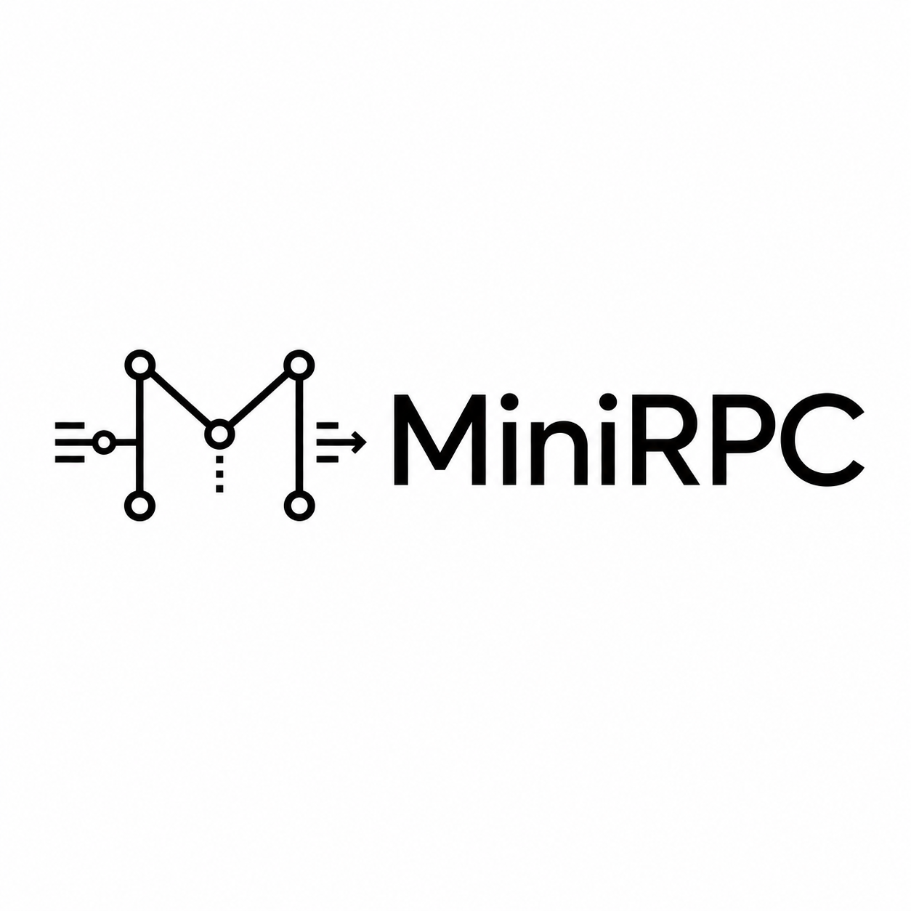
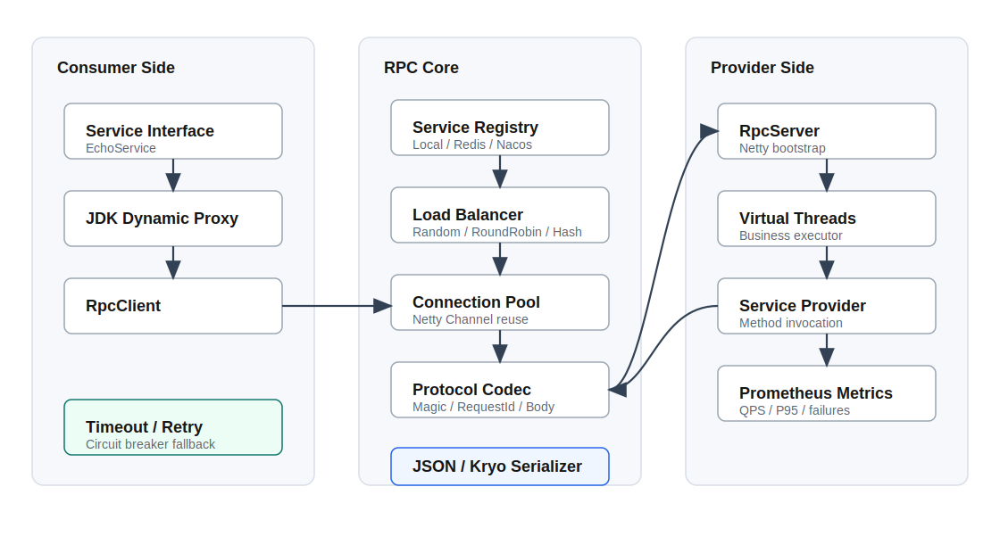

# MiniRPC

基于 Java 21 + Netty 实现的轻量级高并发 RPC 框架，支持服务注册发现、JDK 动态代理、自定义二进制协议、JSON / Kryo 序列化、负载均衡、连接复用、心跳检测、超时重试、熔断降级、Virtual Threads 业务执行器和 Prometheus 指标暴露。

<!-- PROJECT SHIELDS -->

[![Contributors][contributors-shield]][contributors-url]
[![Forks][forks-shield]][forks-url]
[![Stargazers][stars-shield]][stars-url]
[![Issues][issues-shield]][issues-url]
[![MIT License][license-shield]][license-url]
[![Java 21][java-shield]][java-url]
[![Netty][netty-shield]][netty-url]
[![Maven][maven-shield]][maven-url]

<!-- PROJECT LOGO -->
<br />

<p align="center">
  <a href="https://github.com/CozyOct1/MiniRPC">
    
  </a>

  <h3 align="center">MiniRPC</h3>
  <p align="center">
    一个面向 Java 后端底层工程实践的轻量级 RPC 框架，用于验证网络通信、自定义协议、注册发现、连接复用、负载均衡、容错治理和可观测性能力。
    <br />
    <a href="https://github.com/CozyOct1/MiniRPC"><strong>查看项目源码 »</strong></a>
    <br />
    <br />
    <a href="https://cozyoct1.github.io/MiniRPC/">项目首页</a>
    ·
    <a href="https://github.com/CozyOct1/MiniRPC/issues">报告 Bug</a>
    ·
    <a href="https://github.com/CozyOct1/MiniRPC/issues">提出新特性</a>
  </p>
</p>

本篇 `README.md` 面向开发者，内容基于当前项目真实代码编写。当前运行环境缺少 `java` 和 `mvn` 命令，因此本地编译、测试和压测结果需要在安装 JDK 21 与 Maven 后执行确认。

## 目录

- [上手指南](#上手指南)
  - [开发前的配置要求](#开发前的配置要求)
  - [安装步骤](#安装步骤)
  - [基础使用](#基础使用)
- [项目功能](#项目功能)
- [配置说明](#配置说明)
- [文件目录说明](#文件目录说明)
- [开发的架构](#开发的架构)
- [示例服务](#示例服务)
- [压测与量化结果](#压测与量化结果)
- [核心实现说明](#核心实现说明)
- [使用到的技术](#使用到的技术)
- [版本控制](#版本控制)
- [当前限制](#当前限制)
- [版权说明](#版权说明)

## 上手指南

MiniRPC 当前定位是轻量级 RPC 框架，主要验证以下能力：

- 使用 JDK 动态代理封装远程调用流程
- 使用 Netty 实现客户端与服务端长连接通信
- 通过自定义二进制协议解决 TCP 粘包拆包
- 支持 JSON 和 Kryo 序列化扩展
- 使用本地注册表完成服务注册与发现
- 提供随机、轮询、一致性 Hash 负载均衡策略
- 支持请求超时、失败重试和熔断保护
- 使用 Java 21 Virtual Threads 执行业务方法
- 暴露 Prometheus text format 指标

### 开发前的配置要求

1. Linux、macOS 或 Windows WSL 环境
2. JDK 21+，用于编译和运行 Virtual Threads 相关代码
3. Maven 3.9+，用于依赖管理、测试和打包
4. Docker，可选，用于启动 Prometheus
5. Git，用于版本管理

推荐环境：

```text
OpenJDK 21+
Apache Maven 3.9+
Docker 24+
```

### 安装步骤

1. Clone the repo

```bash
git clone git@github.com:CozyOct1/MiniRPC.git
cd MiniRPC
```

2. 编译项目

```bash
mvn -q -DskipTests package
```

3. 运行测试

```bash
mvn test
```

4. 可选：启动 Prometheus

```bash
docker compose up -d prometheus
```

如果当前机器没有 JDK 21 或 Maven，需要先安装工具链。当前仓库没有依赖外部注册中心，示例服务默认使用内置本地注册表，可直接运行。

### 基础使用

启动示例应用：

```bash
java -jar target/minirpc-1.0.0.jar
```

示例应用会启动：

```text
RPC Server: 127.0.0.1:9000
Metrics:    http://127.0.0.1:9100/metrics
```

消费者调用方式：

```java
LocalServiceRegistry registry = new LocalServiceRegistry();
RpcServer server = new RpcServer(RpcServerConfig.defaults(9000), registry, new ServiceProvider());
server.publish(EchoService.class, new EchoServiceImpl());
server.start();

try (RpcClient client = new RpcClient(registry)) {
    EchoService echoService = client.create(EchoService.class);
    String result = echoService.echo("hello");
}
```

## 项目功能

| 能力 | 当前实现 |
| --- | --- |
| 动态代理 | 使用 JDK Proxy 将接口方法调用转换为 RPC 请求 |
| Netty 通信 | 客户端与服务端基于 Netty NIO 建立长连接 |
| 自定义协议 | 固定 22 字节协议头，包含 magic、version、serializer、message type、request id、body length |
| 编解码 | `RpcMessageDecoder` 支持半包回退和最大帧长度保护 |
| 序列化 | 内置 JSON 和 Kryo，可通过 `SerializerFactory` 注册扩展实现 |
| 注册发现 | 内置 `LocalServiceRegistry`，抽象接口可扩展 Redis、Nacos、Zookeeper |
| 负载均衡 | 支持随机、轮询和一致性 Hash |
| 连接复用 | `ConnectionPool` 按服务地址缓存 Netty Channel |
| 心跳检测 | 客户端 Idle 事件发送 heartbeat，服务端响应 heartbeat |
| 超时重试 | 客户端按配置控制请求超时和失败重试次数 |
| 熔断保护 | 连续失败达到阈值后短期开启熔断 |
| 业务执行 | 服务端默认使用 Java 21 Virtual Threads 执行业务方法 |
| 可观测性 | 暴露 Prometheus 指标，包含请求数、失败数、重试数、平均耗时和 P95 延迟 |
| 示例 | 提供 EchoService 示例服务 |
| 测试 | 覆盖序列化请求往返和轮询负载均衡 |

## 配置说明

MiniRPC 通过 `RpcClientConfig` 和 `RpcServerConfig` 管理运行参数。

### RpcClientConfig

| 参数 | 默认值 | 说明 |
| --- | ---: | --- |
| `serializerType` | `JSON` | 请求体序列化方式 |
| `loadBalancerType` | `ROUND_ROBIN` | 服务实例负载均衡策略 |
| `timeout` | `3s` | 单次 RPC 调用超时时间 |
| `retries` | `2` | 失败后的最大重试次数 |
| `circuitFailureThreshold` | `5` | 熔断器连续失败阈值 |
| `circuitOpenDuration` | `10s` | 熔断打开后的保护窗口 |

示例：

```java
RpcClientConfig config = new RpcClientConfig(
        SerializerType.KRYO,
        LoadBalancerType.CONSISTENT_HASH,
        Duration.ofSeconds(2),
        1,
        5,
        Duration.ofSeconds(10)
);
```

### RpcServerConfig

| 参数 | 默认值 | 说明 |
| --- | ---: | --- |
| `host` | `127.0.0.1` | 服务端绑定地址 |
| `port` | 调用方传入 | 服务端监听端口 |
| `serializerType` | `JSON` | 服务注册元数据中的默认序列化标记 |
| `virtualThreads` | `true` | 是否使用 Virtual Threads 执行业务方法 |

示例：

```java
RpcServerConfig config = new RpcServerConfig("127.0.0.1", 9000, SerializerType.JSON, true);
```

## 文件目录说明

```text
MiniRPC
├── src/main/java/io/github/cozyoct/minirpc/
│   ├── client/                 RPC 客户端、动态代理和调用链路
│   ├── codec/                  Netty 协议编码器和解码器
│   ├── common/                 通用异常和服务 key 工具
│   ├── config/                 客户端与服务端配置
│   ├── example/                Echo 示例服务和启动入口
│   ├── loadbalance/            随机、轮询、一致性 Hash 负载均衡
│   ├── metrics/                Prometheus 指标采集与 HTTP 暴露
│   ├── protocol/               RPC 消息、请求、响应和协议常量
│   ├── registry/               服务注册发现抽象与本地实现
│   ├── remoting/               Netty 连接池、服务端和处理器
│   ├── serialize/              JSON / Kryo 序列化实现
│   └── tolerant/               熔断器
├── src/test/java/io/github/cozyoct/minirpc/
│   ├── LoadBalancerTest.java   负载均衡测试
│   └── ProtocolCodecTest.java  序列化协议测试
├── docs/
│   ├── index.html              GitHub Pages 页面
│   ├── styles.css              GitHub Pages 样式
│   └── minirpc_LOGO.png        Pages Logo
├── docker/
│   └── prometheus.yml          Prometheus 抓取配置
├── images/
│   ├── logo.png                项目 Logo
│   └── minirpc_framework.svg   项目架构图
├── .github/workflows/
│   └── pages.yml               GitHub Pages 部署 workflow
├── docker-compose.yml          Prometheus 本地观测环境
├── pom.xml                     Maven 构建配置
├── LICENSE                     MIT License
└── README.md
```

## 开发的架构



调用路径：

```text
Consumer Interface
  -> JDK Dynamic Proxy
  -> RpcClient
  -> ServiceRegistry discover
  -> LoadBalancer select
  -> ConnectionPool reuse Channel
  -> RpcMessageEncoder
  -> Netty TCP
  -> RpcMessageDecoder
  -> Virtual Thread business executor
  -> Service implementation
```

响应路径：

```text
Service result
  -> RpcResponse
  -> Serializer
  -> RpcMessageEncoder
  -> Netty TCP
  -> ClientResponseHandler
  -> CompletableFuture by requestId
  -> Dynamic Proxy return value
```

协议头：

```text
Magic(4) | Version(1) | Serializer(1)
MessageType(1) | Reserved(1)
RequestId(8) | BodyLength(4)
Reserved(2) | Body(N)
```

## 示例服务

当前示例接口：

```java
public interface EchoService {
    String echo(String message);

    int add(int left, int right);
}
```

启动入口：

```text
src/main/java/io/github/cozyoct/minirpc/example/DemoApplication.java
```

运行后会输出一次远程 `echo` 和 `add` 调用结果，并启动 Prometheus 指标端点。

## 压测与量化结果

当前仓库尚未提供独立 benchmark 工具。建议在安装 JDK 21 和 Maven 后先执行基础验证：

```bash
mvn test
mvn -q -DskipTests package
java -jar target/minirpc-1.0.0.jar
```

后续可补充 JMH 或自定义压测客户端，建议统计以下指标：

| 场景 | 指标 | 说明 |
| --- | --- | --- |
| 单连接串行调用 | QPS、平均延迟、P95、P99 | 验证协议和序列化基础开销 |
| 多连接并发调用 | QPS、失败率、重试次数 | 验证连接复用和 Netty 吞吐 |
| JSON vs Kryo | 编码耗时、包体大小 | 对比不同序列化方式 |
| 平台线程 vs 虚拟线程 | QPS、上下文切换、CPU | 对比服务端业务执行模型 |
| 熔断场景 | 失败率、恢复时间 | 验证容错策略是否生效 |

说明：

- 当前 `RpcMetrics` 已经提供请求量、失败量、重试量、平均耗时和 P95 延迟。
- Prometheus 可通过 `docker compose up -d prometheus` 启动，默认抓取 `host.docker.internal:9100`。
- 真实性能会受到 CPU、JDK、Netty 参数、序列化方式、网络环境和业务方法耗时影响。

## 核心实现说明

### JDK 动态代理

`RpcClient#create` 使用 JDK Proxy 生成接口代理。调用接口方法时会构造 `RpcRequest`，记录服务名、方法名、参数类型和参数值，再进入远程调用链路。

### Netty 通信链路

客户端 `ConnectionPool` 按 `host:port` 缓存 Channel，避免每次调用重复建连。服务端 `RpcServer` 负责绑定端口、初始化 pipeline，并将业务方法执行提交给业务线程池。

### 自定义协议编解码

`RpcMessageEncoder` 写入固定协议头和 body，`RpcMessageDecoder` 先检查 magic number，再读取 serializer、message type、request id 和 body length。如果 body 未完整到达，会回退 reader index 等待后续数据。

### 注册发现

`ServiceRegistry` 定义注册、注销、心跳和发现接口。当前 `LocalServiceRegistry` 使用内存结构保存服务实例，适合本地 demo 和单测；后续可增加 Redis、Nacos 或 Zookeeper 实现。

### 负载均衡

`LoadBalancer` 抽象服务实例选择逻辑。当前提供随机、轮询和一致性 Hash 三种策略，客户端可通过 `RpcClientConfig` 选择。

### 超时、重试和熔断

客户端为每个 request id 注册 `CompletableFuture`，在指定 timeout 内等待响应。调用失败后按配置重试，连续失败达到阈值后打开熔断器，短时间内拒绝新请求。

### Prometheus 指标

`RpcMetrics` 记录每个接口方法的请求数、失败数、重试数、平均耗时和 P95 延迟，并通过 JDK 内置 `HttpServer` 暴露 `/metrics`。

## 使用到的技术

- Java 21
- Virtual Threads
- Maven
- Netty
- JDK Dynamic Proxy
- Custom Binary Protocol
- JSON / Jackson
- Kryo
- Service Registry / Discovery
- Load Balancing
- Timeout / Retry / Circuit Breaker
- Prometheus Metrics
- Docker Compose
- GitHub Pages

## 版本控制

当前项目使用 Git 进行版本管理，远程仓库：

```text
git@github.com:CozyOct1/MiniRPC.git
```

建议提交前执行：

```bash
mvn test
git diff --check
```

## 当前限制

- 当前注册中心实现为本地内存版本，Redis、Nacos、Zookeeper 仍需按 `ServiceRegistry` 接口扩展。
- 当前响应模型中的复杂对象反序列化需要结合具体 DTO 类型进一步增强。
- 当前心跳用于连接保活，尚未实现注册中心租约过期清理线程。
- 当前熔断器为轻量实现，尚未提供半开状态下的探测请求配额。
- 当前指标以进程内内存保存延迟样本，长时间运行需要滑动窗口或直方图方案。
- 当前缺少独立 benchmark 工具，性能数据需要在完整 Java 工具链环境下补测。

## 版权说明

该项目签署 MIT 授权许可，详情请参阅 [LICENSE](LICENSE)。

<!-- links -->
[contributors-shield]: https://img.shields.io/github/contributors/CozyOct1/MiniRPC.svg?style=flat-square
[contributors-url]: https://github.com/CozyOct1/MiniRPC/graphs/contributors
[forks-shield]: https://img.shields.io/github/forks/CozyOct1/MiniRPC.svg?style=flat-square
[forks-url]: https://github.com/CozyOct1/MiniRPC/network/members
[stars-shield]: https://img.shields.io/github/stars/CozyOct1/MiniRPC.svg?style=flat-square
[stars-url]: https://github.com/CozyOct1/MiniRPC/stargazers
[issues-shield]: https://img.shields.io/github/issues/CozyOct1/MiniRPC.svg?style=flat-square
[issues-url]: https://github.com/CozyOct1/MiniRPC/issues
[license-shield]: https://img.shields.io/github/license/CozyOct1/MiniRPC.svg?style=flat-square
[license-url]: https://github.com/CozyOct1/MiniRPC/blob/main/LICENSE
[java-shield]: https://img.shields.io/badge/Java-21-orange.svg?style=flat-square
[java-url]: https://openjdk.org/projects/jdk/21/
[netty-shield]: https://img.shields.io/badge/Netty-4.1-0f766e.svg?style=flat-square
[netty-url]: https://netty.io/
[maven-shield]: https://img.shields.io/badge/Maven-3.9%2B-c71a36.svg?style=flat-square
[maven-url]: https://maven.apache.org/
